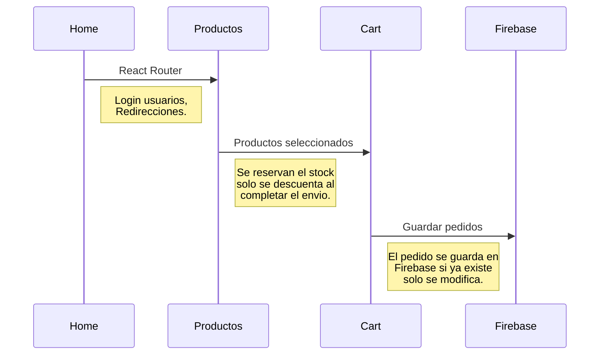
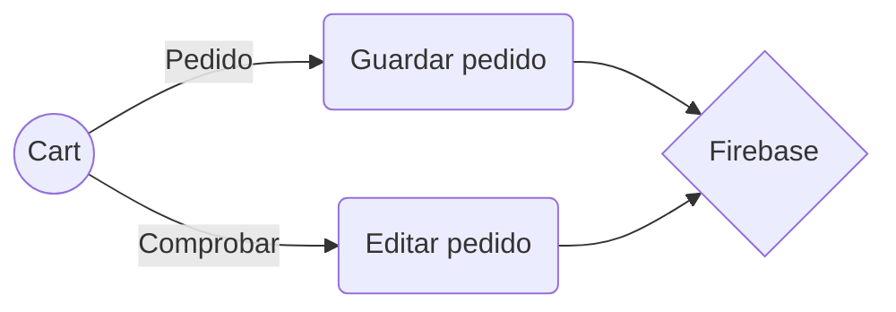

# Bienvenido a mi primer aplicación React.

Esta claro que el diseño y la estetica no son mi fuerte, pero con un poco de voluntad y perceberancia consegui una aplicación que cumple con su objetivo y funciona de manera eficiente.

# Tecnologias aplicadas.

Luego de hacer el curso de Html, css, Js y React, he podido completar este proyecto, el cual fue una adaptación del proyecto HTML a React.

## Instalación

Este proyecto se creo usando la herramienta **Create-React-App.**

## Contenido

Se trata de un e-comerce con gestion de usuarios y conexion a Firebase.

|                |Local                          |Remoto                       |
|----------------|-------------------------------|-----------------------------|
|Header          |`Contenido estatico`         	|"Enlaces"                    |
|NavBar          |`Formato`                      	|Enlaces					   |
|Contenido	 	 |`Información y texto`          	|Valores, precios, productos. |
|Modals			 |`Ventanas Modal para Login y cart`|Información de productos y usuarios.|
|Footer			 |`Enlaces redes sociales, info`	|Enlaces navegación|

## Diagrama limitado del funcionamiento de la App

Un pequeño esquema de funcionamiento de la Aplicación.

Flow de datos al crear una nueva orden:

